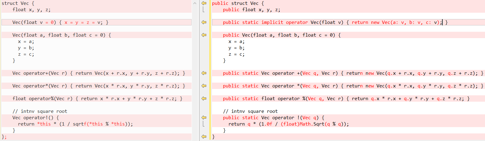
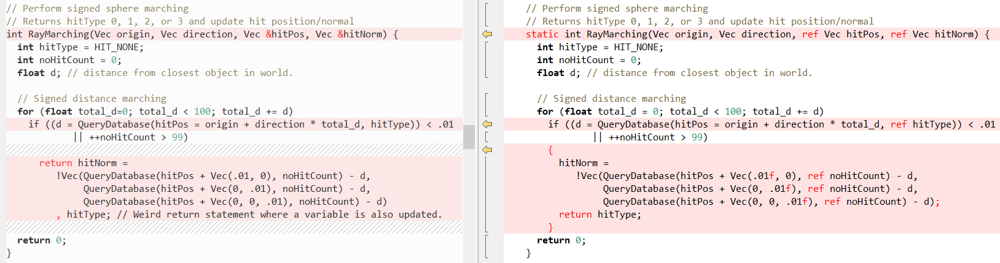
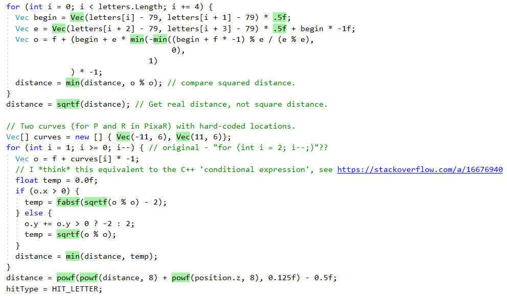
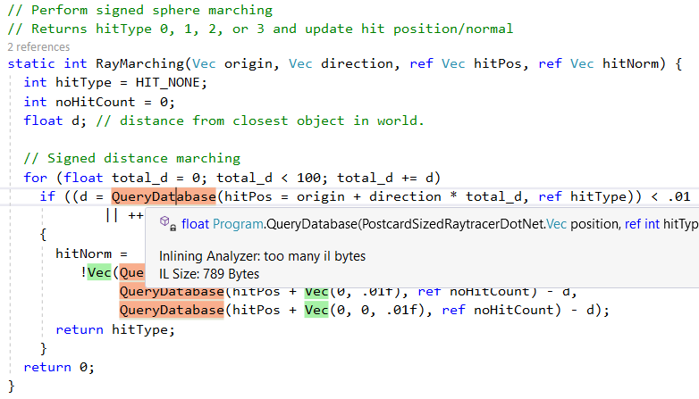

# C# 是低階語言嗎？

[](https://mattwarren.org/2019/03/01/Is-CSharp-a-low-level-language/)[](./zh-TW)

我是 [Fabien Sanglard](http://fabiensanglard.net/) 所做一切的忠實粉絲，我喜歡他的部落格並且從頭到尾讀了他的[兩本](http://fabiensanglard.net/gebbdoom/index.html)[著作](http://fabiensanglard.net/gebbwolf3d/index.html)（對於他的書的更多資訊，可以參考最近的 [Hansleminutes podcast](https://hanselminutes.com/666/episode-666-game-engine-black-book-doom-with-fabien-sanglard)）。

在最近，他寫了一篇精彩的文章，在其中他[破譯了一張明信片大小的光線追蹤器](http://fabiensanglard.net/postcard_pathtracer/index.html)，解開了其中受混淆的程式碼並且對其涉及的數學原理給出了精彩的解釋。我真心推薦你們花點時間去讀一下！

不過，這也讓我開始思考，**有沒有將 C++ 程式碼移植至 C# 的可能？**

其中一部分的原因是由於我的[日常工作](https://raygun.com/platform/apm)，我不得不編寫大量的 C++，並且我發現我開始有點生疏了，所以我想這樣做可能對我有所助益！

不過更為重要的是，我想更深入地去瞭解 **C# 是低階語言嗎？**

一個略有差異但有所相關的問題是「C#適合『系統程式設計』嗎？」對於有關此的更多內容我強烈推薦看看 Joe Duffy [在 2013 年發表的優秀文章](http://joeduffyblog.com/2013/12/27/csharp-for-systems-programming/)。

## 逐行移植

我開始將[反混淆的 C++ 程式碼](http://fabiensanglard.net/postcard_pathtracer/formatted_full.html)逐行移植為 [C#](https://gist.github.com/mattwarren/d17a0c356bd6fdb9f596bee6b9a5e63c)。而事實證明這非常簡單直接，我甚至在想說畢竟 C# 是 C++++ 的故事是真的！！

來看一個例子，程式中主要的資料結構是「vector」，把程式碼像這樣放在一起，左邊是 C++，右邊是 C#：



語法差異當然是有的，不過由於 .NET 容許你自行定義自己的「實值型別」所以得到一樣的功能。這點很重要，將「vector」視為 `struct` 可以使其「資料區域性」更加優良，而且由於資料將進入「堆疊」而不需要涉及 .NET 的垃圾收集（GC）（大概如此，我知道這是個實現細節）。

對於.NET 中的 `struct` 或「實值型別」，可參見：

- 堆積 vs 堆疊、實值型別 vs 參考型別
- 實值型別 vs 參考型別
- .NET 中的記憶體 —— 都去哪兒了
- 實值型別的一些事實
- 堆疊是實作細節，第一部分

特別在最後那篇由 Eric Lippert 的最後一篇文章中有這樣一句十分有幫助的話，這清晰揭示了「實值型別」實際是甚麼：

> 當然，有關實值型別最相關的事實不是關於如何配置<!---->的實作細節，而是「實值型別」總是會「按值」拷貝的的設計語意。如果相關的事是它們的分配細節，那我們就會稱其為「堆疊型別」和「堆積型別」了。然而這在大多數時候並不相關，反之，最相關的是它們的拷貝語意與身分語意。

現在再讓我們看看一些其他方法並排比較的樣子（同樣，左邊是 C++，右邊是 C#），首先是 `RayTracing(..)`：



接下來是 `QueryDatabase(..)`：

.png)

（關於這兩個函式的作用的解釋，可參看 Fabien 的文章）

不過重點還是這個，C# 可以讓我們很容易寫出 C++ 的程式碼！在這時，幫助最大的是 `ref` 關鍵字，這壤我們可以將實值以參考的方式傳遞。我們可以在方法呼叫中使用 `ref` 的功能已經有很長一段時間了，但 C# 正在努力讓更多地方可以使用 `ref`：

- ref 回傳與 ref 局部變數
- C# 7 系列，第 9 部分：ref struct

現在，在某些情況下使用 `ref` 將使程式效能提高，因為 struct 在這些情況下不再需要拷貝，可以參考 Adam Sitniks 的文章以及 C# 中 ref 局部變數與 ref 回傳的效能陷阱以了解更多。

不過這種情形下最為重要的是，這一功能將容許我們在 C# 的移植過程中能夠得到與原始 C++ 程式碼相同的行為。不過我還是要指出，人們所知的「受管理參考」與「指標」並不完全等同，尤其是對於前者是不可以使用數學運算的，對於相關更多可參見：

- ref 的回傳不是指標
- 受管理指標
- 參考不是位址

## 效能

能夠移植程式碼固然很好，不過最終效能也很重要。尤其是類如「光線追蹤」的東西可能需要數分鐘來運作！在 C++ 的程式碼中有個叫 sampleCount 的變數可以控制圖像的最終品質，當設定 `sampleCount = 2` 時，結果看起來會像是這樣：


這顯然談不上真實！

不過當設定 `sampleCount = 2048` 時就變得好多了：


不過設定 `sampleCount = 2048` 時渲染將執行相當長時間，所以之後的所有結果都是將其設定為 `2` 時執行得到的，這也意味著測試執行將在約 1 分鐘內完成。改變 `sampleCount` 僅會影響程式碼最外層迴圈的疊代次數，可以參考此要點來獲取相關解釋。

### 「原生」逐行移植後的結果

為了能夠對 C++ 與 C# 版本作出有意義的對比，我使用了 time-windows 工具，這是 Unix `time` 命令的移植。我最初的結果看起來是這樣：

|                     | C++ (VS 2017) | .NET Framework (4.7.2) | .NET Core (2.2) |
| ------------------- | ------------- | ---------------------- | --------------- |
| Elapsed time (secs) | 47.40         | 80.14                  | 78.02           |
| Kernel time         | 0.14 (0.3%)   | 0.72 (0.9%)            | 0.63 (0.8%)     |
| User time           | 43.86 (92.5%) | 73.06 (91.2%)          | 70.66 (90.6%)   |
| page fault #        | 1,143         | 4,818                  | 5,945           |
| Working set (KB)    | 4,232         | 13,624                 | 17,052          |
| Paged pool (KB)     | 95            | 172                    | 154             |
| Non-paged pool      | 7             | 14                     | 16              |
| Page file size (KB) | 1,460         | 10,936                 | 11,024          |

起初，我們發現 C# 程式碼比起 C++ 版本而言慢了很多，但它確實變得更好了（參看下文）。

無論如何，即便已經使用了「原生」逐行移植，但讓我們先看看 .NET JIT 為我們做了甚麼。首先，它在內嵌較小的「輔助方法」上做得很好，我們可以透過查看優秀的內嵌分析工具的輸出看到這一點（綠色覆蓋的=內嵌的）：



不過不是所有方法都內嵌了，比如 `QueryDatabase(..)` 就因為過於複雜而跳過了：



另一個由 .NET 及時（JIT）編譯器所提供的特性是將特定方法的呼叫轉換為相應的 CPU 指令。我們可以透過 `sqrt` 包裝函式注意到這點，這是原始的 C# 程式碼（注意對 `Math.Sqrt` 的呼叫）：

```csharp
// intnv square root
public static Vec operator !(Vec q) {
  return q * (1.0f / (float)Math.Sqrt(q % q));
}
```

然後是 .NET JIT 產生的組合語言程式碼，可以看到並沒有呼叫 `Math.Sqrt` 並且其使用了 `vsqrtsd` CPU 指令：

```nasm
; Assembly listing for method Program:sqrtf(float):float
; Emitting BLENDED_CODE for X64 CPU with AVX - Windows
; Tier-1 compilation
; optimized code
; rsp based frame
; partially interruptible
; Final local variable assignments
;
;  V00 arg0         [V00,T00] (  3,  3   )   float  ->  mm0
;# V01 OutArgs      [V01    ] (  1,  1   )  lclBlk ( 0) [rsp+0x00]   "OutgoingArgSpace"
;
; Lcl frame size = 0

G_M8216_IG01:
       vzeroupper

G_M8216_IG02:
       vcvtss2sd xmm0, xmm0
       vsqrtsd  xmm0, xmm0
       vcvtsd2ss xmm0, xmm0

G_M8216_IG03:
       ret

; Total bytes of code 16, prolog size 3 for method Program:sqrtf(float):float
; ============================================================
```

（你可以使用「Disasmo」VS2019 增益功能透過這些說明來獲得這些輸出，或者去 SharpLab.io 查看）

這種替換也稱為「內在（intrinsic）」，我們可以在下列的程式碼中看到 JIT 對它們的生成。這個片段只展示了對 `AMD64` 的映射。除此以外對於 `X86`、`ARM` 與 `ARM64`，JIT 對於這些也有對應目標，完整的方法可以參看此處。

```cpp
bool Compiler::IsTargetIntrinsic(CorInfoIntrinsics intrinsicId)
{
#if defined(_TARGET_AMD64_) || (defined(_TARGET_X86_) && !defined(LEGACY_BACKEND))
  switch (intrinsicId)
  {
    // AMD64/x86 has SSE2 instructions to directly compute sqrt/abs and SSE4.1
    // instructions to directly compute round/ceiling/floor.
    //
    // TODO: Because the x86 backend only targets SSE for floating-point code,
    //       it does not treat Sine, Cosine, or Round as intrinsics (JIT32
    //       implemented those intrinsics as x87 instructions). If this poses
    //       a CQ problem, it may be necessary to change the implementation of
    //       the helper calls to decrease call overhead or switch back to the
    //       x87 instructions. This is tracked by #7097.
    case CORINFO_INTRINSIC_Sqrt:
    case CORINFO_INTRINSIC_Abs:
      return true;

    case CORINFO_INTRINSIC_Round:
    case CORINFO_INTRINSIC_Ceiling:
    case CORINFO_INTRINSIC_Floor:
      return compSupports(InstructionSet_SSE41);

    default:
      return false;
  }
  ...
}
```

正如你所建，某些方法會是像這樣實作的，例如 Sqrt 和 Abs，但對於其他的比如 `powf`，CLR 則會取代使用 C++ 執行期函式來實作。

這整個過程在《.NET Framework 是如何實作 Math.Pow 的?》中有很好的解釋，不過我們也可以在 CoreCLR 來源中看到這是如何運作的：

- `COMSingle::Pow` 實作，比如從 C# 程式碼中呼叫 `MathF.Pow(..)` 時執行的方法
- 映射至 C 執行期方法實作
- `powf` 跨平台版本實作，這確保了跨越系統時程式會有相同的行為

### 簡單對效能改進後的成果

我想說看看我的「原生」逐行移植有沒有改進空間，在一番分析後我做出了兩個主要改變：

- 移除行內陣列初始化
- 將 `Math.XXX(..)` 切換為 `MathF.XXX()` 的對應函式

接下來將深入解釋這些變化

#### 移除行內陣列初始化

關於為何需要這樣做的更多資訊，可參閱這篇由 Andrey Akinshin 在 Stack Overflow 所做出的優秀回答，並且其中還包括基準測試和組合語言程式碼！其得到的結論如下：

> #### 結論
>
> **.NET 會快取硬編碼的局部陣列嗎？**大體上算是：Roslyn編譯器會將其放入元資料中。
>
> **在這種情形下我們是否會有任何額外開銷？**很不幸，會有：JIT會在每次引動時從元資料中拷貝字串的內容。這種方式的工作時間比起靜態陣列來說更長。執行期也會分配物件並產生記憶體流量。
>
> **我們應當關心這點嗎？** 這取決於具體情形。如果這是個熱方法，並且你想要取得優良的效能，你應該使用靜態陣列。如果這是個不會影響應用程式的冷方法，此時你應該做的是寫出「良好的」程式碼，並將陣列放在方法的作用區域之中。

你可以在此差異中看到我所做出的變更。

#### 用 MathF 函式替換 Math

之後但很重要的是，我透過以下變更獲得了很大的效能提升：

```cs
#if NETSTANDARD2_1 || NETCOREAPP2_0 || NETCOREAPP2_1 || NETCOREAPP2_2 || NETCOREAPP3_0
  // intnv square root
  public static Vec operator !(Vec q) {
    return q * (1.0f / MathF.Sqrt(q % q));
  }
#else
  public static Vec operator !(Vec q) {
    return q * (1.0f / (float)Math.Sqrt(q % q));
  }
#endif
```

自「.NET Standard 2.1」起，常見的數學函式現在都有了其特定的 `float` 實作並位於 `System.MathF` 類別中。對於此 API 及其實作的更多資料可參見：

- 單精度數學的新 API
- 增加單精度數學函式
- 為新的單精度數學 API 提供一組單元測試
- System.Math 與 System.MathF 應當作為受管理程式碼實作而非 C 執行期的 FCALL
- 將 Math.Abs(double) 和 Math.Abs(float) 移動至受管理程式碼來實作
- 向 .NET 添加平台相依內在函式的設計與處理

經歷了這些修改後，C# 程式碼比 C++ 版本的慢了約 10%。

|                     | C++ (VS C++ 2017) | .NET Framework (4.7.2) | .NET Core (2.2) TC OFF | .NET Core (2.2) TC ON |
| ------------------- | ----------------- | ---------------------- | ---------------------- | --------------------- |
| Elapsed time (secs) | 41.38             | 58.89                  | 46.04                  | 44.33                 |
| Kernel time         | 0.05 (0.1%)       | 0.06 (0.1%)            | 0.14 (0.3%)            | 0.13 (0.3%)           |
| User time           | 41.19 (99.5%)     | 58.34 (99.1%)          | 44.72 (97.1%)          | 44.03 (99.3%)         |
| page fault #        | 1,119             | 4,749                  | 5,776                  | 5,661                 |
| Working set (KB)    | 4,136             | 13,440                 | 16,788                 | 16,652                |
| Paged pool (KB)     | 89                | 172                    | 150                    | 150                   |
| Non-paged pool      | 7                 | 13                     | 16                     | 16                    |
| Page file size (KB) | 1,428             | 10,904                 | 10,960                 | 11,044                |

TC = 分層編譯（Tiered Compilation）（我相信這在 .NET Core 3.0 會成為默認功能）

為完整性起見，以下列出了多次運行的結果：

| Run        | C++ (VS C++ 2017) | .NET Framework (4.7.2) | .NET Core (2.2) TC OFF | .NET Core (2.2) TC ON |
| ---------- | ----------------- | -------------------- -- | ---------------------- | --------------------- |
| TestRun-01 | 41.38             | 58.89                  | 46.04                  | 44.33                 |
| TestRun-02 | 41.19             | 57.65                  | 46.23                  | 45.96                 |
| TestRun-03 | 42.17             | 62.64                  | 46.22                  | 48.73                 |

注意：.NET Core 與 .NET Framework 之間的差異是由後者缺乏 MathF API 導致的，對於有關此的詳細資料可參見支援 netstandard 2.1 的 .Net Framework (4.8?)。

## 更進一步的效能提升

不過我相信會有人做得更好！

如果你有興趣嘗試縮小差距，那麼 C# 程式碼在這兒可供使用。你也可以透過出色的編譯管理員查閱 C++ 所產生的組合語言來去做對比。

最後，或許有用的是 Visual Studio Profiler 所展示的（在經過上述效能改進之後）對「hot path」的輸出。

-Report20190221-2029-After-MathF-Changes-NetCore.png)

## 那 C# 是低階語言嗎？

或者更確切些說：

> C#/F#/VB.NET 或者 BCL/執行期功能的哪些特徵可支援「低階」*程式。

\* 嗯，我知道「低階」是個主觀的術語😊

**注意**：任何 C# 開發者都會對「低階」的含意有著不同的理解，C++ 或 Rust 程式設計師會認為這些功能是理所當然的。

這是我所列出的清單：

- ref 回傳與 ref 局部變數
  - 「一言蔽之，透過引用的傳遞與回傳避免大型結構的複製。其型式與記憶體都是安全的。甚至可能會比 `unsafe` 的還要**快**！」
- .NET中的不安全程式碼
  - 「如同之前的章節所定義的，核心 C# 語言與 C 和 C++ 顯著的不同之處在於前者省略了指標作為資料的類別。與此對應的是 C# 提供了引用與建立由垃圾收集器管理的物件的能力。這種設計與其他功能相結合使得 C# 成為了比 C 或者 C++ 更安全的語言。」
- .NET 中的受管理指標
  - 「不過，CLR 中還有另一種指標類型：受管理指標。這種指標可定義為更為通用的引用型別，而且可能會指向其他位置而不僅是物件的開頭。」
- C# 7 系列，第 10 部分： `Span<T>` 以及通用記憶體管理
  - 「`System.Span<T>` 是一種僅堆疊的型別（`ref struct`），其包裝了所有的記憶體存取形式並且是通用的記憶體存取類型。你可以理解為 `Span` 的實作包含有一個虛引用和長度，並接受所有的 3 種記憶體存取類別。」
- 互通性（C# 程式設計手冊）
  - 「.NET Framework 透過平台引動服務、`System.Runtime.InteropServices` 名稱空間、C++ 互通性以及 COM 互通性（COM interop）實現與非受管理程式碼的互通性」

不過我知道我自己的侷限所以我在 twitter 上詢問並得到了更多的回應並將其添加在列表中：

Ben Adams “Platform intrinsics (CPU instruction access)”
Marc Gravell “SIMD via Vector (which mixes well with Span) is *fairly* low; .NET Core should (soon?) offer direct CPU intrinsics for more explicit usage targeting particular CPU ops"
Marc Gravell “powerful JIT: things like range elision on arrays/spans, and the JIT using per-struct-T rules to remove huge chunks of code that it knows can’t be reached for that T, or on your particular CPU (BitConverter.IsLittleEndian, Vector.IsHardwareAccelerated, etc)”
Kevin Jones “I would give a special shout-out to the MemoryMarshal and Unsafe classes, and probably a few other things in the System.Runtime.CompilerServices namespace.”
Theodoros Chatzigiannakis “You could also include __makeref and the rest.”
damageboy “Being able to dynamically generate code that fits the expected input exactly, given that the latter will only be known at runtime, and might change periodically?”
Robert Haken “dynamic IL emission”
Victor Baybekov “Stackalloc was not mentioned. Also ability to write raw IL (not dynamic, so save on a delegate call), e.g. to use cached ldftn and call them via calli. VS2017 has a proj template that makes this trivial via extern methods + MethodImplOptions.ForwardRef + ilasm.exe rewrite.”
Victor Baybekov “Also MethodImplOptions.AggressiveInlining “does enable ‘low-level’ programming” in a sense that it allows to write high-level code with many small methods and still control JIT behavior to get optimized result. Otherwise uncomposable 100s LOCs methods with copy-paste…”
Ben Adams “Using the same calling conventions (ABI) as the underlying platform and p/invokes for interop might be more of a thing though?”
Victor Baybekov “Also since you mentioned #fsharp - it does have inline keyword that does the job at IL level before JIT, so it was deemed important at the language level. C# lacks this (so far) for lambdas which are always virtual calls and workarounds are often weird (constrained generics).”
Alexandre Mutel “new SIMD intrinsics, Unsafe Utility class/IL post processing (e.g custom, Fody…etc.). For C#8.0, upcoming function pointers…”
Alexandre Mutel “related to IL, F# has support for direct IL within the language for example”
OmariO “BinaryPrimitives. Low-level but safe.” (https://docs.microsoft.com/en-us/dotnet/api/system.buffers.binary.binaryprimitives?view=netcore-3.0)
Kouji (Kozy) Matsui “How about native inline assembler? It’s difficult for how relation both toolchains and runtime, but can replace current P/Invoke solution and do inlining if we have it.”
Frank A. Krueger “Ldobj, stobj, initobj, initblk, cpyblk.”
Konrad Kokosa “Maybe Thread Local Storage? Fixed Size Buffers? unmanaged constraint and blittable types should be probably mentioned:)”
Sebastiano Mandalà “Just my two cents as everything has been said: what about something as simple as struct layout and how padding and memory alignment and order of the fields may affect the cache line performance? It’s something I have to investigate myself too”
Nino Floris “Constants embedding via readonlyspan, stackalloc, finalizers, WeakReference, open delegates, MethodImplOptions, MemoryBarriers, TypedReference, varargs, SIMD, Unsafe.AsRef can coerce struct types if layout matches exactly (used for a.o. TaskAwaiter and its version)"
So in summary, I would say that C# certainly lets you write code that looks a lot like C++ and in conjunction with the Runtime and Base-Class Libraries it gives you a lot of low-level functionality

Discuss this post on Hacker News, /r/programming, /r/dotnet or /r/csharp

Further Reading
Patterns for high-performance C#. by Federico Andres Lois
Performance Quiz #6 — Chinese/English Dictionary reader (From 2005, 2 Microsoft bloggers have a ‘performance’ battle, C++ v. C#)
Performance Quiz #6 — Conclusion, Studying the Space
How much faster is C++ than C#?
Optimizing managed C# vs. native C++ code (2005)
The Unity ‘Burst’ Compiler:

How Unity is making (a subset of) C# as fast as C++
Unity Burst Compiler: Performance Optimization Made Easy
Daily Pathtracer Part 3: C# & Unity & Burst
C++, C# and Unity
Deep Dive into the Burst Compiler - Unite LA
